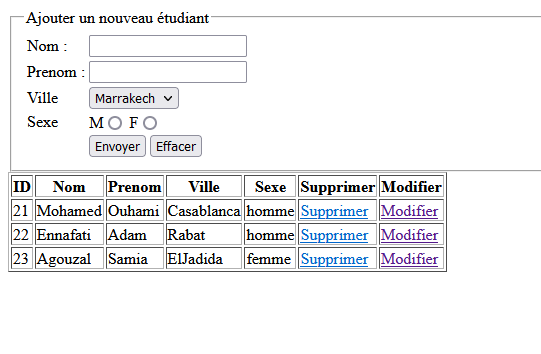

# Application Android de Gestion des Étudiants

Bienvenue à l'Application Android de Gestion des Étudiants. Cette application vous permet de lister les étudiants et d'ajouter de nouveaux étudiants en utilisant des services web PHP. Vous trouverez ci-dessous des instructions sur l'installation de l'application, ainsi qu'une vidéo de démonstration et une capture d'écran de l'application web montrant les étudiants ajoutés.

## Installation

Pour installer cette application sur votre appareil Android, suivez ces étapes simples :

1. Ouvrir le projet dans Android Studio.

2. Assurez-vous que toutes les dépendances et bibliothèques nécessaires sont installées pour le bon fonctionnement de l'application.

3. Appuyez sur le bouton "Lancer" dans Android Studio pour déployer l'application sur votre appareil ou émulateur.

## Fonctionnalités de l'Application

L'application offre les fonctionnalités suivantes :

- **Liste des Étudiants** : Affiche la liste des étudiants récupérée à partir du service web PHP.

- **Ajouter un Étudiant** : Permet d'ajouter un nouvel étudiant en saisissant les détails requis.

- **Vidéo de Démonstration** : Regardez la vidéo de démonstration pour voir comment l'application fonctionne en cliquant sur le lien ci-dessous :

- **Capture d'Écran de l'Application Web** : Consultez la capture d'écran ci-dessous montrant les étudiants ajoutés via le service web.

## Configuration des Services Web PHP

Pour que cette application fonctionne correctement, assurez-vous de configurer correctement les services web PHP. Voici quelques étapes clés à suivre :

1. Assurez-vous que les services web PHP sont correctement installés et en cours d'exécution.

2. Modifiez les paramètres de l'application pour indiquer l'URL du service web PHP.

3. Assurez-vous que le service web PHP expose des API pour lister les étudiants et ajouter de nouveaux étudiants.

4. Assurez-vous que le service web PHP est sécurisé et dispose des autorisations appropriées pour effectuer des opérations de lecture et d'écriture.

Nous espérons que cette application vous sera utile dans la gestion de vos étudiants. Merci de l'utiliser !